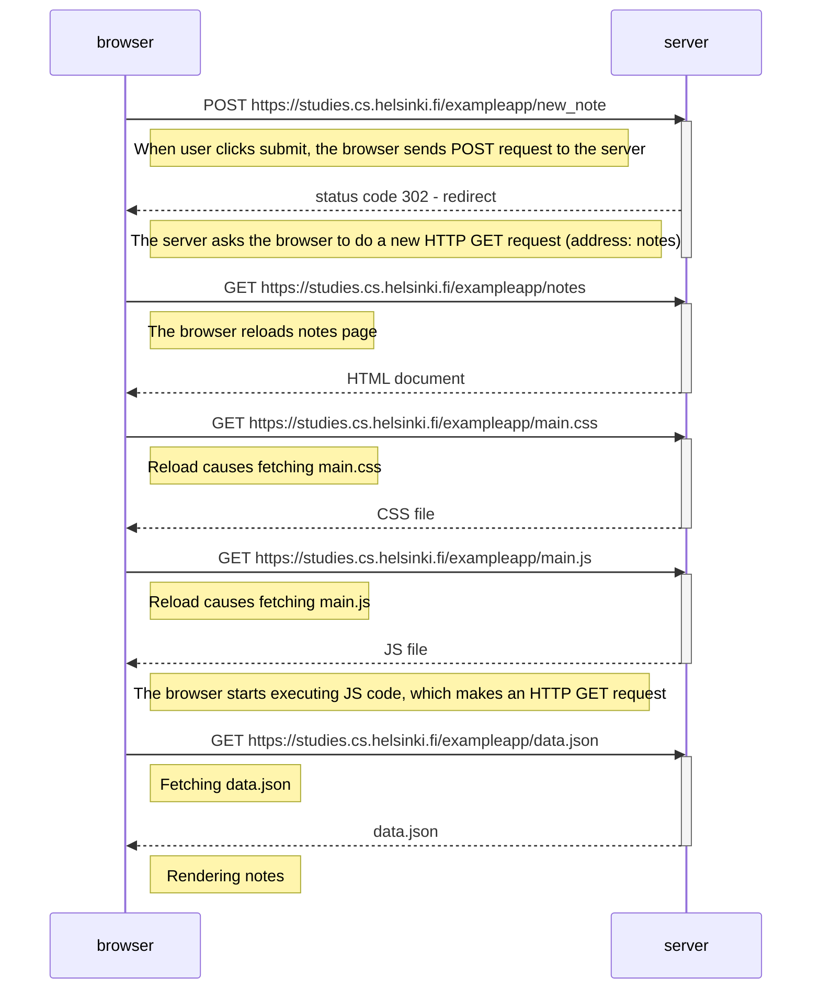

```mermaid
sequenceDiagram
    participant browser
    participant server

browser->>server: POST https://studies.cs.helsinki.fi/exampleapp/new_note
activate server
Note right of browser: When user clicks submit, the browser sends POST request to the server
server-->>browser: status code 302 - redirect
Note right of browser: The server asks the browser to do a new HTTP GET request (address: notes)
deactivate server

browser->>server: GET https://studies.cs.helsinki.fi/exampleapp/notes
activate server
Note right of browser: The browser reloads notes page
server-->>browser: HTML document
deactivate server

browser->>server: GET https://studies.cs.helsinki.fi/exampleapp/main.css
activate server
Note right of browser: Reload causes fetching main.css
server-->>browser: CSS file
deactivate server

browser->>server: GET https://studies.cs.helsinki.fi/exampleapp/main.js
activate server
Note right of browser: Reload causes fetching main.js
server-->>browser: JS file
deactivate server
Note right of browser: The browser starts executing JS code, which makes an HTTP GET request

browser->>server: GET https://studies.cs.helsinki.fi/exampleapp/data.json
activate server
Note right of browser: Fetching data.json
server-->>browser: data.json
deactivate server
Note right of browser: Rendering notes

```

